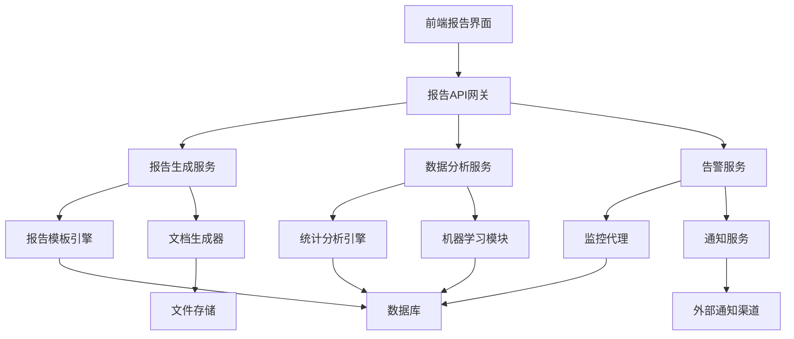
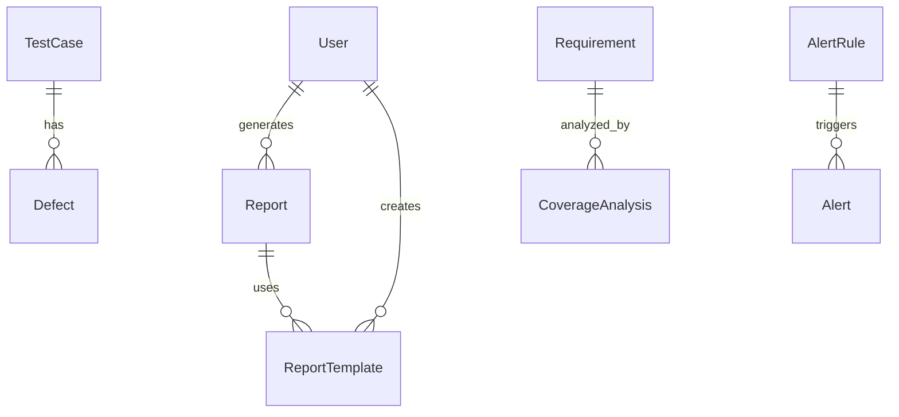

# 智能测试报告生成和分析功能设计文档

## 概述

本设计文档描述了为汽车座椅软件测试智能体系统新增的智能测试报告生成和分析功能的技术架构、组件设计和实现方案。该功能将为现有系统增加强大的数据分析、报告生成和智能建议能力。

## 架构设计

### 整体架构



### 核心服务架构

1. **报告生成服务** - 负责各类报告的生成和导出
2. **数据分析服务** - 提供统计分析、趋势分析和智能建议
3. **告警服务** - 实时监控和异常告警
4. **模板管理服务** - 报告模板的创建、管理和渲染

## 组件和接口设计

### 1. 报告生成组件

#### ReportGenerator 类
```python
class ReportGenerator:
    def generate_execution_report(self, test_cases: List[TestCase], 
                                execution_results: List[ExecutionResult]) -> Report
    def generate_defect_analysis_report(self, defects: List[Defect], 
                                      time_range: DateRange) -> Report
    def generate_coverage_report(self, requirements: List[Requirement], 
                               test_cases: List[TestCase]) -> Report
    def export_report(self, report: Report, format: ReportFormat) -> bytes
```

#### 报告类型定义
- **ExecutionReport**: 测试执行报告
- **DefectAnalysisReport**: 缺陷分析报告  
- **CoverageReport**: 覆盖率分析报告
- **TrendReport**: 趋势分析报告
- **CustomReport**: 自定义报告

### 2. 数据分析组件

#### AnalyticsEngine 类
```python
class AnalyticsEngine:
    def analyze_test_coverage(self, requirements: List[Requirement], 
                            test_cases: List[TestCase]) -> CoverageAnalysis
    def analyze_defect_patterns(self, defects: List[Defect]) -> DefectPatternAnalysis
    def predict_risk_areas(self, historical_data: HistoricalData) -> RiskPrediction
    def generate_optimization_suggestions(self, test_suite: TestSuite) -> List[Suggestion]
```

#### 分析算法
- **覆盖率计算算法**: 基于需求-测试用例映射关系
- **缺陷模式识别**: 使用聚类算法识别相似缺陷
- **趋势预测**: 时间序列分析预测缺陷趋势
- **智能建议**: 基于规则引擎和机器学习的建议生成

### 3. 实时监控组件

#### MonitoringService 类
```python
class MonitoringService:
    def monitor_test_execution(self, execution_id: str) -> ExecutionStatus
    def check_system_health(self) -> SystemHealthStatus
    def evaluate_alert_conditions(self, metrics: SystemMetrics) -> List[Alert]
    def send_notifications(self, alerts: List[Alert]) -> None
```

#### 监控指标
- **执行性能指标**: 响应时间、吞吐量、错误率
- **系统资源指标**: CPU、内存、磁盘使用率
- **业务指标**: 测试通过率、覆盖率、缺陷密度

### 4. 模板管理组件

#### TemplateManager 类
```python
class TemplateManager:
    def create_template(self, template_config: TemplateConfig) -> Template
    def render_template(self, template: Template, data: Dict) -> RenderedReport
    def manage_template_versions(self, template_id: str) -> List[TemplateVersion]
    def validate_template(self, template: Template) -> ValidationResult
```

## 数据模型设计

### 新增数据表

#### 1. 报告表 (reports)
```sql
CREATE TABLE reports (
    id INTEGER PRIMARY KEY,
    title VARCHAR(200) NOT NULL,
    report_type VARCHAR(50) NOT NULL,
    template_id INTEGER,
    generated_by INTEGER,
    generation_time DATETIME,
    data_range_start DATETIME,
    data_range_end DATETIME,
    report_data JSON,
    file_path VARCHAR(500),
    status VARCHAR(20),
    created_at DATETIME,
    updated_at DATETIME
);
```

#### 2. 缺陷表 (defects)
```sql
CREATE TABLE defects (
    id INTEGER PRIMARY KEY,
    test_case_id INTEGER,
    defect_type VARCHAR(50),
    severity VARCHAR(20),
    description TEXT,
    root_cause TEXT,
    status VARCHAR(20),
    detected_at DATETIME,
    resolved_at DATETIME,
    created_at DATETIME
);
```

#### 3. 覆盖率分析表 (coverage_analysis)
```sql
CREATE TABLE coverage_analysis (
    id INTEGER PRIMARY KEY,
    requirement_id INTEGER,
    function_module VARCHAR(100),
    coverage_percentage FLOAT,
    covered_test_cases INTEGER,
    total_test_cases INTEGER,
    analysis_date DATETIME,
    created_at DATETIME
);
```

#### 4. 告警规则表 (alert_rules)
```sql
CREATE TABLE alert_rules (
    id INTEGER PRIMARY KEY,
    rule_name VARCHAR(100),
    metric_type VARCHAR(50),
    condition_operator VARCHAR(10),
    threshold_value FLOAT,
    severity VARCHAR(20),
    notification_channels JSON,
    is_active BOOLEAN,
    created_at DATETIME
);
```

#### 5. 报告模板表 (report_templates)
```sql
CREATE TABLE report_templates (
    id INTEGER PRIMARY KEY,
    template_name VARCHAR(100),
    template_type VARCHAR(50),
    template_content TEXT,
    template_config JSON,
    created_by INTEGER,
    is_default BOOLEAN,
    created_at DATETIME,
    updated_at DATETIME
);
```

### 数据关系图



## 错误处理策略

### 1. 报告生成错误处理
- **数据不足错误**: 提供默认值或提示用户补充数据
- **模板渲染错误**: 回退到默认模板或简化版本
- **导出格式错误**: 提供替代格式选项

### 2. 分析计算错误处理
- **数据质量问题**: 数据清洗和验证机制
- **算法计算异常**: 降级到简单统计方法
- **性能超时**: 分批处理和异步计算

### 3. 监控告警错误处理
- **监控数据缺失**: 使用历史数据估算
- **告警发送失败**: 多渠道重试机制
- **系统过载**: 告警频率限制和优先级排序

## 测试策略

### 1. 单元测试
- 报告生成逻辑测试
- 数据分析算法测试
- 模板渲染功能测试
- 告警规则评估测试

### 2. 集成测试
- 端到端报告生成流程测试
- 数据库集成测试
- 外部服务集成测试
- 文件导出功能测试

### 3. 性能测试
- 大数据量报告生成性能测试
- 并发用户访问测试
- 实时监控响应时间测试
- 内存和CPU使用率测试

### 4. 用户体验测试
- 报告界面易用性测试
- 报告内容准确性验证
- 告警及时性测试
- 多设备兼容性测试

## 安全考虑

### 1. 数据安全
- 敏感数据加密存储
- 报告访问权限控制
- 数据传输加密
- 审计日志记录

### 2. 接口安全
- API访问认证和授权
- 请求频率限制
- 输入数据验证
- SQL注入防护

### 3. 文件安全
- 报告文件访问控制
- 临时文件清理机制
- 文件上传安全检查
- 病毒扫描集成

## 性能优化

### 1. 数据处理优化
- 数据库查询优化和索引设计
- 分页和懒加载机制
- 缓存热点数据
- 异步处理长时间任务

### 2. 报告生成优化
- 模板预编译和缓存
- 增量数据更新
- 并行处理多个报告
- 压缩和优化输出文件

### 3. 前端性能优化
- 图表数据分批加载
- 虚拟滚动处理大列表
- 组件懒加载
- 静态资源CDN加速

## 部署和运维

### 1. 部署架构
- 微服务容器化部署
- 负载均衡和高可用配置
- 数据库主从复制
- 文件存储分布式部署

### 2. 监控和日志
- 应用性能监控(APM)
- 业务指标监控
- 结构化日志记录
- 错误追踪和告警

### 3. 备份和恢复
- 数据库定期备份
- 报告文件备份策略
- 灾难恢复预案
- 数据迁移工具